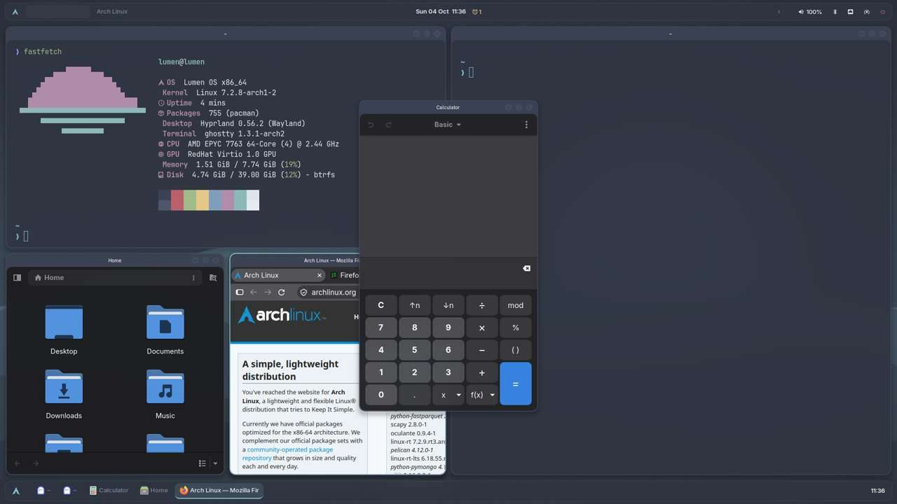
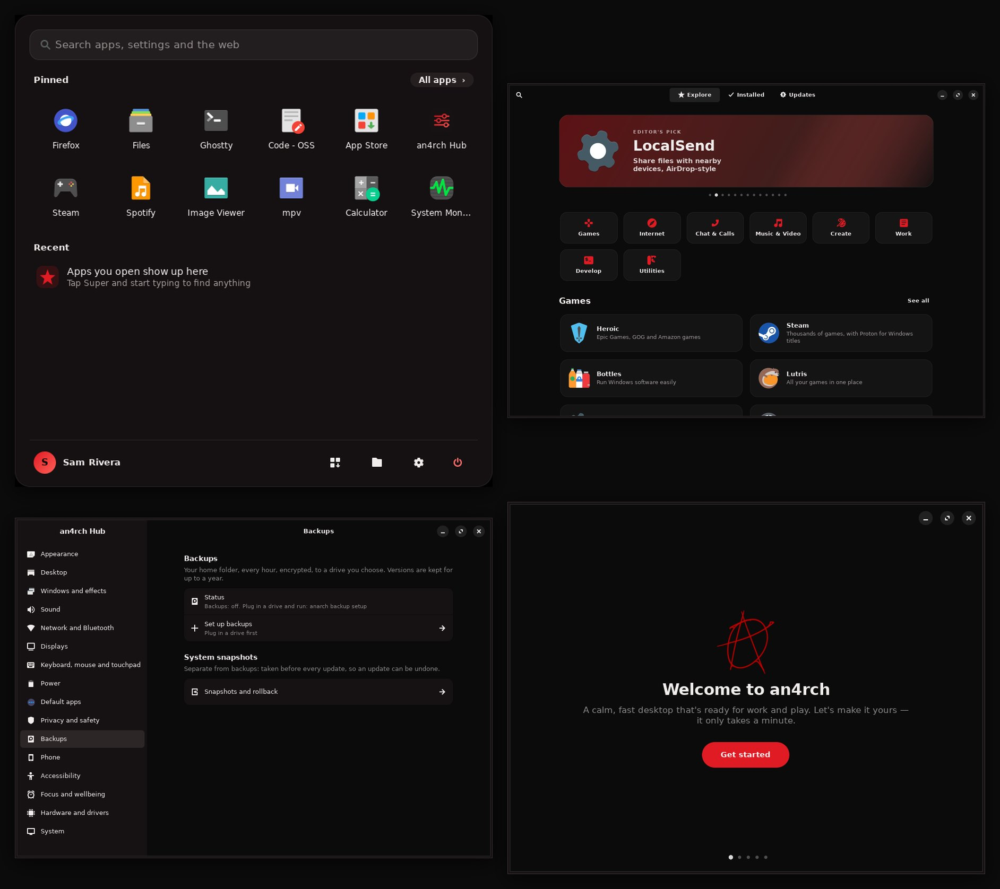
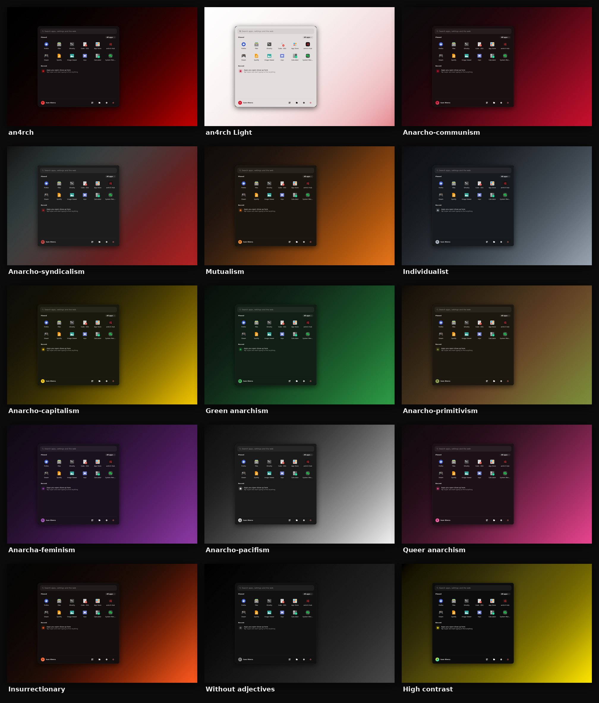
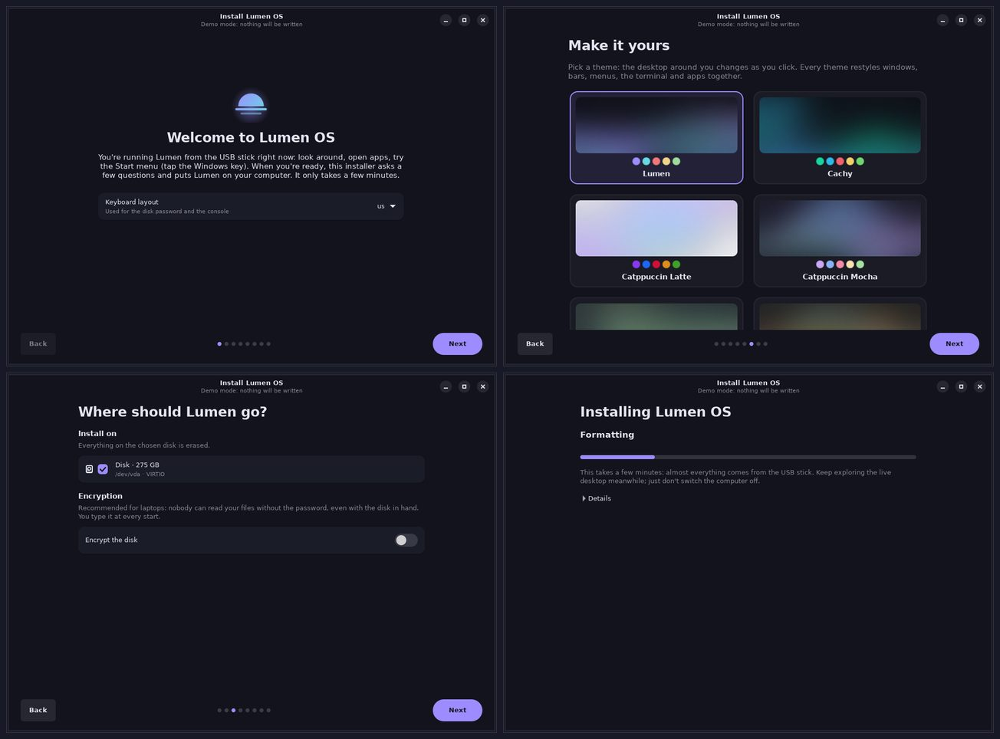

<p align="center"></p>

<h1 align="center">an4rch OS</h1>

<p align="center"><strong>An Arch-based Linux distribution that's calm, fast, private, and ready for work and play the moment you log in.</strong></p>

<p align="center"><a href="https://github.com/an4rchuk/an4rch-os/releases">Download</a> · <a href="docs/README.md">Manual</a> · <a href="docs/releases/v1.1.1.md">What's new in 1.1.1</a> · <a href="docs/ROADMAP.md">Roadmap</a> · <a href="https://an4rch.uk">an4rch.uk</a></p>

an4rch OS takes inspiration from [Omarchy](https://omarchy.org) (an opinionated, keyboard-first Hyprland desktop on plain Arch), [Bazzite](https://bazzite.gg) (try it live before installing, roll back any update, gaming ready, a friendly app store) and [CachyOS](https://cachyos.org) (tuned for speed, a teal look of its own). It ships as a bootable USB image; the same desktop also installs on any existing Arch system.


<sub>A real an4rch OS install, screenshotted by the automated VM test: title bars with minimise, maximise and close on every window, and the taskbar along the bottom.</sub>

- **Try it before you install.** The USB boots to a live an4rch desktop with the installer open. Pick a theme and the desktop restyles as you click, then install in a few minutes: the packages come on the stick.
- **Windows behave like you expect:** title bars with minimise, maximise and close buttons, double-click to maximise, and a Windows-style taskbar along the bottom (on by default, one switch to turn off).
- **Tap the Windows key** for the Start menu: pinned apps, recent apps, everything A–Z, and a search that also finds settings, does maths and searches the web.
- **App Store** for Flathub, the Arch repositories and the AUR in one place, with screenshots, one-click install, and updates.
- **Snapshots on every update**, so a bad update is one click (or one reboot into the LTS kernel) away from undone.
- **Gaming in one click:** Steam, Proton tools, GameMode, MangoHud, gamescope and an optional Steam Game Mode session.
- **Tuned out of the box,** CachyOS-style: per-disk I/O schedulers, NTSYNC and gaming sysctls, plus live-switchable sched-ext CPU schedulers and the zen kernel with `anarch tune`.
- **Extras in one command,** like Bazzite's `ujust`: game streaming (Sunshine), Decky, RGB, GPU control, Android apps, containers, VMs, Tailscale.
- **Private and safe by default:** a panic key that hides everything in one press, encrypted folders, sandboxed apps, encrypted DNS with tracker blocking, made-up hardware addresses on every network, and drive health monitoring.
- **The best ideas from other systems:** automatic light and dark by sunset (macOS), sticky notes (Windows), Quick Share by QR code (Android), Screen Time, Storage Sense, battery charge limits and a Powerwash-style reset (ChromeOS).
- **Looks after itself:** encrypted hourly backups to a drive, the right graphics driver picked for you, Secure Boot with your own keys, screens scaled to fit, and if an update breaks the desktop, the login screen offers to undo it.
- **Your phone and computer together:** notifications, files both ways and a shared clipboard, set up in one command.
- **Your install, your way:** desktop, Game edition (starts in Steam's Big Picture, like a Steam Deck) or server, your choice of kernel (latest, LTS, zen or hardened) and shell (zsh, bash or fish), extra apps ticked while installing, or your own partitions.


<sub>The Start menu, App Store, a settings search in Start, and the welcome tour, rendered from the real apps during testing (with a fallback font instead of Inter).</sub>

Underneath is a polished [Hyprland](https://hypr.land) desktop. It sets up a clean top bar, a launcher and menus for everything, themes that restyle the whole system at once, and the everyday tools already wired in: screenshots, screen recording, clipboard history, reminders, an emoji picker, a calculator, OCR and web apps. Wi-Fi, Bluetooth, audio, displays, sleep, login, fingerprint, printing, updates and installing apps are each one key away.


<sub>Mock-ups of nine of the bundled themes (Cachy, the CachyOS-inspired teal, is in the installer below), drawn on the wallpapers an4rch paints for each one.</sub>

## Install

**an4rch OS (recommended).** Get the ISO from the [releases](https://github.com/an4rchuk/an4rch-os/releases) or the latest run of the [*iso* workflow](https://github.com/an4rchuk/an4rch-os/actions/workflows/iso.yml) (or build it with `sudo iso/build.sh` on Arch). Write it to a USB stick (8 GB or more), turn off Secure Boot, and boot it (UEFI recommended; older legacy BIOS computers work too).

You land on a live an4rch desktop with **Install an4rch OS** open, Bazzite-style. Look around first if you like, then answer a few questions: keyboard, Wi-Fi, disk and encryption, your account, time zone, a theme and layout, and your apps. The stick carries every package a default install needs, so installing takes minutes rather than a long download. It sets up encrypted btrfs with snapshots, systemd-boot with an LTS fallback kernel, the boot splash and the desktop. Prefer text? Pick *an4rch OS installer (text mode)* in the boot menu. See [an4rch OS](docs/09-lumen-os.md).



**On an existing Arch install,** logged in as your user:

```sh
curl -fsSL https://raw.githubusercontent.com/an4rchuk/an4rch-os/HEAD/boot.sh | bash
```

Answer a few questions (browser, terminal, editor, gaming), wait a few minutes, then restart. See [Getting started](docs/01-getting-started.md).

## What you get

| | |
| --- | --- |
| **an4rch OS** | Arch-based live USB with a graphical installer (and a text-mode one) that installs from the stick in minutes: encrypted btrfs, automatic snapshots and one-click rollback, rescue mode from the USB, systemd-boot with an LTS fallback, Plymouth, zram, multilib on, and a welcome tour on first boot |
| **Start menu** | Tap the Windows key. Pins, recents, all apps, and search across apps, settings, maths, commands and the web. Right-click to pin or uninstall |
| **App Store** | GTK 4 / libadwaita store over Flathub, the Arch repos and the AUR: curated Explore page, screenshots, per-app source choice, Installed and Updates tabs |
| **Gaming** | Steam + Proton, 32-bit drivers for your GPU, GameMode, MangoHud, gamescope, ProtonPlus, and an optional Steam Big Picture session |
| **Desktop** | Hyprland 0.55+ with its new Lua config, run as a proper systemd session by uwsm. Title bars with minimise, maximise and close on every window, real minimise and restore, gentle animations, blur, rounded corners, and a scrolling layout one key away |
| **Taskbar** | Optional Windows-style bar along the bottom: Start, open windows (click to minimise or restore, middle-click to close), minimised windows and the clock. Turn it on in Settings or the installer's *Classic* layout |
| **Top bar** | Waybar: workspaces, window title, clock and calendar, reminders, media, privacy indicators, recording, toggles, tray, audio, Bluetooth, network, power profile, battery. Click anything to open its panel |
| **Launcher and menus** | fuzzel for apps, windows, the an4rch menu, Wi-Fi, displays, power, themes, wallpapers, clipboard and emoji: one consistent look everywhere |
| **Themes** | Eleven palettes (an4rch, Cachy, Tokyo Night, Catppuccin Mocha & Latte, Gruvbox, Nord, Rosé Pine, Everforest, Kanagawa, High contrast). One key restyles borders, bar, menus, notifications, lock screen, terminal, prompt, `btop`, `fzf` and GTK apps. `anarch anarch` adds twelve more: the [anarchism theme pack](docs/03-themes.md#theme-packs-anarch-anarch). Every theme gets nine wallpapers painted from its colours, five of them long smooth gradients. [Make your own](docs/03-themes.md#making-your-own-theme) in ten lines |
| **Wallpapers** | Original abstract wallpapers painted from each theme's colours on your machine (no downloads, no licensing questions), plus your own |
| **Everyday tools** | Screenshots with annotation, screen recording, clipboard history, reminders, emoji, calculator with units and currencies, colour picker, OCR, web search, web apps |
| **System** | Wi-Fi menu, Bluetooth, audio mixer and output switcher, display arrangement with automatic revert, power profiles, night light, idle and sleep, lock screen, login screen with keyring unlock, fingerprint, printing, firewall |
| **Apps** | Browser, terminal (Ghostty) and code editor of your choice, file manager, image viewer, video player, PDF viewer, plus a searchable installer for the repos, AUR and Flathub, and one-click bundles for development and gaming |
| **Shell** | zsh with autosuggestions, syntax highlighting, the starship prompt, zoxide, fzf, eza and bat |
| **Performance** | Tuned sysctls, I/O schedulers and NTSYNC by default; `anarch tune` for sched-ext CPU schedulers (bpfland, lavd, …), the zen kernel and mirror ranking |
| **Extras** | `anarch extras`: Sunshine, Decky Loader, controllers, Handheld Daemon, OpenRGB, LACT, Distrobox, Waydroid, virt-manager, Tailscale |
| **Development** | `anarch dev`: languages through mise, Docker, and local Postgres, MySQL, Redis or MongoDB in one command |
| **Privacy and safety** | The panic key (<kbd>SUPER</kbd> + <kbd>SHIFT</kbd> + <kbd>Esc</kbd>), `anarch privacy` (random MAC, encrypted DNS, tracker blocking), `anarch vault` encrypted folders, `anarch sandbox`, `anarch scrub` for hidden file data, camera, microphone and screen-share indicators |
| **Health and upkeep** | `anarch health` (drives, filesystem, space, battery, services, temperatures, checked daily), `anarch tidy`, `anarch battery limit`, `anarch reset`, `anarch carry` to move your setup to another computer |
| **Accessibility** | `anarch a11y`: screen reader, bigger text and cursor, no animations, and a High contrast theme |
| **Everyday extras** | `anarch auto` light/dark by sunset, `anarch note` drop-down notes, `anarch say` read aloud, `anarch share` QR codes for your phone, `anarch screentime`, `anarch focus` |
| **Updates** | One key updates an4rch, packages, Flatpaks and firmware. Your config files are never overwritten |

## The keyboard in one minute

| Keys | |
| --- | --- |
| <kbd>SUPER</kbd> (tap) | Start menu |
| <kbd>SUPER</kbd> + <kbd>SPACE</kbd> | Quick launcher |
| <kbd>SUPER</kbd> + <kbd>A</kbd> | App Store |
| <kbd>SUPER</kbd> + <kbd>ALT</kbd> + <kbd>SPACE</kbd> | an4rch menu: everything else |
| <kbd>SUPER</kbd> + <kbd>/</kbd> | Searchable list of every key binding |
| <kbd>SUPER</kbd> + <kbd>Enter</kbd> / <kbd>B</kbd> / <kbd>E</kbd> / <kbd>C</kbd> | Terminal / browser / files / code editor |
| <kbd>SUPER</kbd> + <kbd>W</kbd> | Close window |
| <kbd>SUPER</kbd> + <kbd>,</kbd> / <kbd>SUPER</kbd> + <kbd>SHIFT</kbd> + <kbd>M</kbd> | Minimise window / bring one back |
| <kbd>SUPER</kbd> + <kbd>1</kbd>…<kbd>0</kbd> | Workspaces (with <kbd>SHIFT</kbd>: take the window along) |
| <kbd>Print</kbd> | Screenshot a region |
| <kbd>SUPER</kbd> + <kbd>V</kbd> | Clipboard history |
| <kbd>SUPER</kbd> + <kbd>CTRL</kbd> + <kbd>T</kbd> | Change theme |
| <kbd>SUPER</kbd> + <kbd>Esc</kbd> | Power menu |

The pattern: <kbd>SUPER</kbd> for apps and windows, <kbd>+SHIFT</kbd> to move and capture, <kbd>+CTRL</kbd> for system toggles and style, <kbd>+ALT</kbd> for setup panels. [All key bindings](docs/02-keybindings.md).

## The manual

| | |
| --- | --- |
| [Getting started](docs/01-getting-started.md) | Install, first login, the essentials |
| [Key bindings](docs/02-keybindings.md) | Every shortcut |
| [Themes and wallpapers](docs/03-themes.md) | Switching, wallpapers, making your own |
| [Customising](docs/04-customizing.md) | Where settings live, overriding defaults, Hyprland Lua recipes |
| [Built-in tools](docs/05-tools.md) | Screenshots, recording, clipboard, reminders, emoji, calculator, OCR, web apps |
| [System and hardware](docs/06-system.md) | Network, Bluetooth, audio, displays, sleep, login, fingerprint, printing, updates, apps |
| [Troubleshooting](docs/07-troubleshooting.md) | `anarch doctor`, logs, recovery |
| [How an4rch works](docs/08-architecture.md) | Architecture, theme engine, tests |
| [an4rch OS](docs/09-lumen-os.md) | The ISO and installer, Start menu, App Store, gaming, snapshots and rescue |
| [Power tools](docs/10-power-tools.md) | `anarch tune`, `anarch extras`, `anarch dev`, theme sharing, battery warnings |
| [Privacy, safety and accessibility](docs/11-privacy-and-safety.md) | The panic key, network privacy, vaults, sandboxes, health checks, accessibility |
| [Borrowed from other systems](docs/12-borrowed-features.md) | Auto light/dark, notes, read aloud, Quick Share, Screen Time, tidy, battery limit, reset |

On the desktop: <kbd>SUPER</kbd> + <kbd>F1</kbd>, or `anarch manual` in a terminal.

## Principles

- **Your files are yours.** an4rch's defaults live in `~/.local/share/lumen` and load first. Your files in `~/.config` load after them and are never overwritten by updates.
- **Nothing strands you.** Display changes revert unless you confirm them, configs are backed up before replacement, and a broken theme or wallpaper falls back gracefully.
- **Every feature is a command.** `anarch help` lists them all, so you can bind, script or combine any of them.
- **Upstream formats.** Each app keeps its native config format, documented and commented, with no new configuration language on top.

## Development

```sh
tests/run.sh
```

checks the Hyprland Lua config against an API snapshot taken from Hyprland's source (unknown options, rule fields, dispatchers, events, duplicate bindings), renders every theme, runs shellcheck on every script, validates the Waybar config and generates sample wallpapers. See [How an4rch works](docs/08-architecture.md).

The *e2e* workflow tests the real thing: it builds the ISO, boots the live USB, installs an4rch OS unattended in a virtual machine, then logs in and runs through everyday tasks (apps, Start search, themes, screenshots, minimise and the taskbar, audio, network, lock and unlock), screenshotting the desktop as it goes.

## Where it's going

The plan for the next releases (an4rch Hub, OTA image updates, a handheld edition and more) is in the [roadmap](docs/ROADMAP.md). Ideas and bug reports are welcome as issues.

Built on [Hyprland](https://hypr.land), [uwsm](https://github.com/Vladimir-csp/uwsm), [Waybar](https://github.com/Alexays/Waybar), [fuzzel](https://codeberg.org/dnkl/fuzzel), [mako](https://github.com/emersion/mako), [Ghostty](https://ghostty.org), [greetd](https://sr.ht/~kennylevinsen/greetd/), [cliphist](https://github.com/sentriz/cliphist), [Satty](https://github.com/gabm/Satty) and the rest of the excellent Wayland ecosystem.
